# OfficeTracker - Complete App Flow

```mermaid
flowchart TD
    Start([User Installs App]) --> Launch[App Opens]
    Launch --> OnboardingStart{First Time User?}
    
    OnboardingStart -->|Yes| Welcome[Welcome Screen]
    OnboardingStart -->|No| LoadData[Load User Data from Firebase]
    
    Welcome --> GetCompany[Enter Company Name & Address]
    GetCompany --> NotifPerm{Grant Notification Permission?}
    
    NotifPerm -->|Yes| SaveToken[Register FCM Token in Firebase]
    NotifPerm -->|No| SkipToken[Skip FCM Registration]
    
    SaveToken --> ModeSelect[Select Tracking Mode]
    SkipToken --> ModeSelect
    
    ModeSelect --> ManualMode{Manual Mode?}
    ManualMode -->|Yes| SetupManual[Setup Manual Mode]
    ManualMode -->|No| SetupAuto[Setup Auto Mode]
    
    SetupManual --> SaveData1[Save to Firebase:<br/>trackingMode: manual<br/>settings: manual]
    SaveData1 --> ManualHome[Home Screen - Manual Mode]
    
    SetupAuto --> LocationPerm{Request Location Permission}
    LocationPerm -->|While Using| PartialAuto[Limited Auto Mode]
    LocationPerm -->|Always Allow| FullAuto[Full Auto Mode]
    LocationPerm -->|Denied| FallbackManual[Fallback to Manual]
    
    PartialAuto --> SaveData2[Save to Firebase:<br/>trackingMode: auto<br/>settings: auto]
    FullAuto --> SaveData3[Save to Firebase:<br/>trackingMode: auto<br/>settings: auto<br/>+ Start Geofencing]
    FallbackManual --> SetupManual
    
    SaveData2 --> AutoHome[Home Screen - Auto Mode]
    SaveData3 --> AutoHome
    
    LoadData --> CheckMode{Check trackingMode}
    CheckMode -->|manual| ManualHome
    CheckMode -->|auto| AutoHome
    
    %% Manual Mode Daily Flow
    ManualHome --> ManualDaily[Manual Mode Daily Flow]
    ManualDaily --> M10AM{10 AM Weekday?}
    M10AM -->|Yes + No Attendance Logged| Notif10AM[🌅 Morning Check-in Notification]
    M10AM -->|No| M1PM
    
    Notif10AM --> UserAction1{User Action?}
    UserAction1 -->|Tap Notification| OpenApp1[Open App]
    UserAction1 -->|Tap Office Button| LogOffice1[Log: Office]
    UserAction1 -->|Tap WFH Button| LogWFH1[Log: WFH]
    UserAction1 -->|Ignore| M1PM
    
    OpenApp1 --> ManualLog1[Manual Log Attendance]
    LogOffice1 --> UpdateDB1[Update Firebase attendanceData]
    LogWFH1 --> UpdateDB1
    ManualLog1 --> UpdateDB1
    
    UpdateDB1 --> M1PM{1 PM Weekday?}
    M1PM -->|Yes + No Attendance Logged| Notif1PM[☀️ Afternoon Reminder]
    M1PM -->|No| M4PM
    
    Notif1PM --> UserAction2{User Action?}
    UserAction2 -->|Log Attendance| UpdateDB2[Update Firebase]
    UserAction2 -->|Ignore| M4PM
    
    UpdateDB2 --> M4PM{4 PM Weekday?}
    M4PM -->|Yes + No Attendance Logged| Notif4PM[🌆 End of Day Reminder]
    M4PM -->|No| WeeklyCheck
    
    Notif4PM --> UserAction3{User Action?}
    UserAction3 -->|Log Attendance| UpdateDB3[Update Firebase]
    UserAction3 -->|Ignore| WeeklyCheck
    
    UpdateDB3 --> WeeklyCheck
    
    %% Auto Mode Daily Flow
    AutoHome --> AutoDaily[Auto Mode Daily Flow]
    AutoDaily --> CheckPerm{Has Always Allow?}
    
    CheckPerm -->|Yes| Geofence[Geofencing Active]
    CheckPerm -->|No| OpenApp2[User Opens App]
    
    Geofence --> NearOffice{User Near Office<br/>100m radius?}
    NearOffice -->|Yes| UpdateNearOffice[Update Firebase:<br/>nearOffice.detected = true]
    NearOffice -->|No| WaitGeo[Wait for Location Change]
    
    UpdateNearOffice --> CloudFunction[Cloud Function Triggered:<br/>onNearOfficeDetected]
    CloudFunction --> CheckAlreadyLogged{Attendance<br/>Already Logged?}
    
    CheckAlreadyLogged -->|Yes| NoNotif[Skip Notification]
    CheckAlreadyLogged -->|No| SendGeoNotif[📍 Send Notification:<br/>Near Office Detected]
    
    SendGeoNotif --> GeoAction{User Action?}
    GeoAction -->|Tap 🏢 In Office| LogOfficeGeo[Log: Office]
    GeoAction -->|Tap 🏠 WFH| LogWFHGeo[Log: WFH]
    GeoAction -->|Ignore| Auto6PM
    
    LogOfficeGeo --> UpdateDBAuto1[Update Firebase attendanceData]
    LogWFHGeo --> UpdateDBAuto1
    
    OpenApp2 --> CheckLocation[Check Current Location]
    CheckLocation --> Near{Within 100m<br/>of Office?}
    Near -->|Yes| AutoLogOffice[Auto Log: Office]
    Near -->|No| WaitOpen[Wait for User to Log]
    
    AutoLogOffice --> UpdateDBAuto2[Update Firebase attendanceData]
    WaitOpen --> Auto6PM
    UpdateDBAuto1 --> Auto6PM
    UpdateDBAuto2 --> Auto6PM
    NoNotif --> Auto6PM
    WaitGeo --> Auto6PM
    
    Auto6PM{6 PM Weekday?}
    Auto6PM -->|Yes + No Attendance Logged| Notif6PM[🏢 Location Not Logged<br/>Open app to manually log]
    Auto6PM -->|No| WeeklyCheck
    
    Notif6PM --> Auto6Action{User Action?}
    Auto6Action -->|Open App| OpenAppManual[Open App & Manually Log]
    Auto6Action -->|Ignore| WeeklyCheck
    
    OpenAppManual --> UpdateDBAuto3[Update Firebase]
    UpdateDBAuto3 --> WeeklyCheck
    
    %% Weekly Notifications (Both Modes)
    WeeklyCheck{Monday/Friday<br/>9 AM?}
    WeeklyCheck -->|Yes| WeeklySummary[📅/📊 Weekly Check-in<br/>Review your stats]
    WeeklyCheck -->|No| Midnight
    
    WeeklySummary --> WeeklyAction{User Action?}
    WeeklyAction -->|Open App| ViewStats[View Analytics Screen]
    WeeklyAction -->|Ignore| Midnight
    
    ViewStats --> Midnight
    
    %% Midnight Reset
    Midnight{Midnight<br/>12:00 AM?}
    Midnight -->|Yes| ResetFlags[Cloud Function:<br/>resetNearOfficeFlags]
    Midnight -->|No| NextDay
    
    ResetFlags --> ResetNearOffice[Set nearOffice.detected = false<br/>for all users]
    ResetNearOffice --> NextDay[Next Day Begins]
    
    NextDay --> CheckModeAgain{Check Mode}
    CheckModeAgain -->|Manual| ManualDaily
    CheckModeAgain -->|Auto| AutoDaily
    
    %% Mode Switching
    ManualHome --> SwitchToAuto{User Switches<br/>to Auto Mode?}
    SwitchToAuto -->|Yes| LocationPerm
    
    AutoHome --> SwitchToManual{User Switches<br/>to Manual Mode?}
    SwitchToManual -->|Yes| StopGeo[Stop Geofencing]
    StopGeo --> SetupManual
    
    %% Edge Cases
    ManualHome -.->|Weekend/Holiday| SkipNotif1[Skip All Notifications]
    AutoHome -.->|Weekend/Holiday| SkipNotif2[Skip All Notifications]
    
    SkipNotif1 --> Midnight
    SkipNotif2 --> Midnight
    
    %% FCM Token Management
    SaveToken -.->|Token Saved| FCMData[(Firebase:<br/>fcmToken<br/>platform<br/>deviceModel)]
    UpdateDB1 -.->|Preserve| FCMData
    UpdateDB2 -.->|Preserve| FCMData
    UpdateDB3 -.->|Preserve| FCMData
    UpdateDBAuto1 -.->|Preserve| FCMData
    UpdateDBAuto2 -.->|Preserve| FCMData
    UpdateDBAuto3 -.->|Preserve| FCMData
    
    style Start fill:#4F46E5,color:#fff
    style ManualHome fill:#10B981,color:#fff
    style AutoHome fill:#3B82F6,color:#fff
    style SaveToken fill:#F59E0B,color:#fff
    style FCMData fill:#EF4444,color:#fff
    style CloudFunction fill:#8B5CF6,color:#fff
    style ResetFlags fill:#8B5CF6,color:#fff
    style Midnight fill:#6366F1,color:#fff
```



## Key Features Summary

### 🔔 Notification Schedule

#### **Manual Mode**
- **10 AM** - Morning check-in (if not logged)
- **1 PM** - Afternoon reminder (if not logged)  
- **4 PM** - End of day reminder (if not logged)
- **Skipped**: Weekends, public holidays, already logged days

#### **Auto Mode**
- **Geofence Trigger** - When near office (100m) → Interactive notification
- **6 PM** - Reminder if location not detected all day
- **Skipped**: Weekends, public holidays, already logged days

#### **Both Modes**
- **Monday 9 AM** - Weekly check-in
- **Friday 9 AM** - Weekly summary
- **Skipped**: Public holidays only

### 🌍 Location Permissions

| Permission | Manual Mode | Auto Mode |
|------------|-------------|-----------|
| **Denied** | ✅ Works normally | ❌ Falls back to Manual |
| **While Using** | ✅ Works normally | ⚠️ Partial (requires app open) |
| **Always Allow** | ✅ Works normally | ✅ Full geofencing |

### 🔄 Daily Reset (Midnight)

Cloud Function runs at **12:00 AM AEST**:
- Resets `nearOffice.detected = false` for all users
- Prepares for next day's geofence triggers
- Prevents duplicate notifications

### 💾 Firebase Data Structure

```
users/
  {userId}/
    fcmToken: "ExponentPushToken[...]"
    platform: "ios"
    deviceModel: "iPhone 11 Pro Max"
    userData:
      companyName: "ANZ"
      companyAddress: "..."
      companyLocation: { lat, lng }
      trackingMode: "manual" | "auto"
      country: "australia"
    settings:
      trackingMode: "manual" | "auto"
      monthlyTarget: 15
      targetMode: "days"
      notificationsEnabled: true
    attendanceData:
      "2026-01-09": "office"
      "2026-01-08": "wfh"
    nearOffice:
      detected: true | false
      timestamp: 1767877213814
      date: "2026-01-09"
    cachedHolidays:
      "2026-01-26": "Australia Day"
```

### 🚀 Cloud Functions

1. **send10AMReminder** - Manual mode, daily 10 AM
2. **send1PMReminder** - Manual mode, daily 1 PM
3. **send4PMReminder** - Manual mode, daily 4 PM
4. **send6PMAutoReminder** - Auto mode, daily 6 PM
5. **sendMondaySummary** - Both modes, Monday 9 AM
6. **sendFridaySummary** - Both modes, Friday 9 AM
7. **onNearOfficeDetected** - Database trigger for geofencing
8. **resetNearOfficeFlags** - Daily midnight reset
9. **sendTestNotification** - HTTP endpoint for testing

### 📱 Notification Actions

When user near office in auto mode:
```
📍 Near Office Detected
We detected you near your office. Where are you working today?

[🏢 In Office]  [🏠 Working from Home]
```

User can tap buttons without opening app → Attendance logged immediately.

